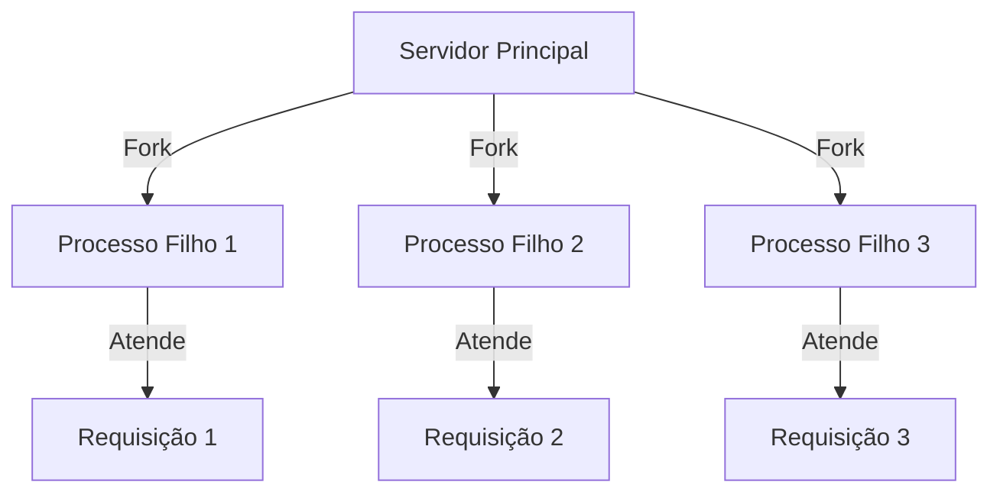
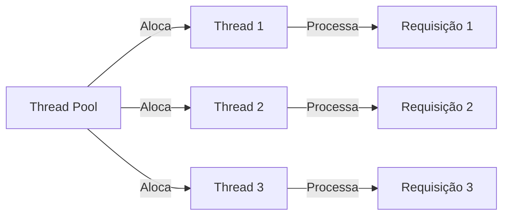
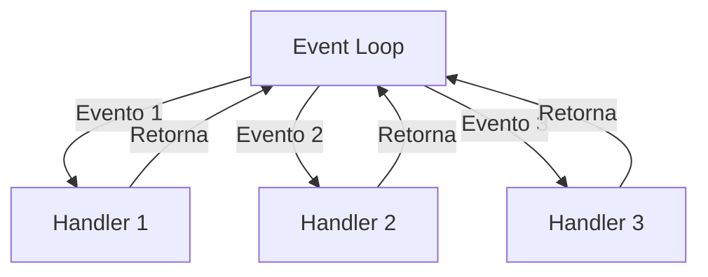

# História dos Servidores Web

## 1. A Origem da Web e o Primeiro Servidor HTTP

### CERN e o Nascimento da Web (1989-1991)

Tim Berners-Lee, trabalhando no CERN, propôs um "sistema de hipertexto" para compartilhar documentos científicos. Seu documento de 1989, "HyperText and CERN", definiu os conceitos fundamentais:

- URLs (endereços web)
- HTML (linguagem de marcação)
- HTTP (protocolo de comunicação)

### CERN httpd: O Pioneiro

O primeiro servidor web, **CERN httpd**, foi desenvolvido por Berners-Lee, Ari Luotonen e Henrik Frystyk Nielsen. Seu funcionamento era simples:

1. Aceitar conexões TCP na porta 80
2. Ler a linha de requisição (ex: `GET /index.html`)
3. Mapear o caminho para um arquivo no disco
4. Enviar o conteúdo e fechar a conexão

A primeira página web foi publicada em dezembro de 1990 em `http://info.cern.ch/`.

## 2. Evolução dos Modelos de Servidor

### 2.1 Modelo Fork (Anos 90)



- Cada requisição gerava um novo processo (fork)
- Alto consumo de recursos
- Limitado pela memória do sistema

### 2.2 Modelo Thread-per-Request



Características:
- Pool pré-alocado de threads
- Melhor uso de recursos
- Mais escalável que fork
- Usado em servidores Java (Tomcat, Jetty)

### 2.3 Modelo Event-Loop (2009+)



Características:
- Single-thread com I/O não bloqueante
- Altamente eficiente para I/O
- Popularizado pelo Node.js
- Bom para muitas conexões simultâneas

## 3. Servidores Embutidos nas Linguagens

### 3.1 Java (1997+)
```java
HttpServer server = HttpServer.create(new InetSocketAddress(8000), 0);
server.createContext("/api", (HttpExchange t) -> {
    String response = "Hello World";
    t.sendResponseHeaders(200, response.length());
    try (OutputStream os = t.getResponseBody()) {
        os.write(response.getBytes());
    }
});
server.start();
```

### 3.2 Python (2000+)
```python
from http.server import HTTPServer, BaseHTTPRequestHandler

class Handler(BaseHTTPRequestHandler):
    def do_GET(self):
        self.send_response(200)
        self.end_headers()
        self.wfile.write(b'Hello World')

HTTPServer(('', 8000), Handler).serve_forever()
```

### 3.3 Node.js (2009+)
```javascript
const http = require('http');

http.createServer((req, res) => {
    res.writeHead(200);
    res.end('Hello World');
}).listen(8000);
```

### 3.4 Go (2009+)
```go
package main

import (
    "fmt"
    "net/http"
)

func main() {
    http.HandleFunc("/", func(w http.ResponseWriter, r *http.Request) {
        fmt.Fprintf(w, "Hello World")
    })
    http.ListenAndServe(":8000", nil)
}
```

## 4. Tendências Modernas

### 4.1 Microsserviços
- Servidores menores e especializados
- Comunicação via HTTP/gRPC
- Containers e orquestração

### 4.2 Serverless
- Funções como serviço (FaaS)
- Sem gerenciamento de servidor
- Escalabilidade automática

### 4.3 Edge Computing
- Servidores na borda da rede
- Menor latência
- Distribuição global

## 5. O Futuro dos Servidores Web

### 5.1 HTTP/3 e QUIC
- Baseado em UDP
- Melhor performance
- Menos latência

### 5.2 WebAssembly
- Código nativo no navegador
- Novos tipos de aplicações
- Melhor performance

### 5.3 Web3 e Descentralização
- Servidores distribuídos
- Blockchain e P2P
- Novas arquiteturas

## Próximos Passos

- [O Pacote net/http](03-net-http.md)
- [Criando Servidores HTTP](../2-servidor/01-criando-servidor.md) 