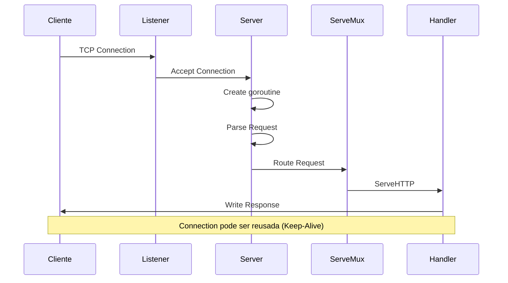
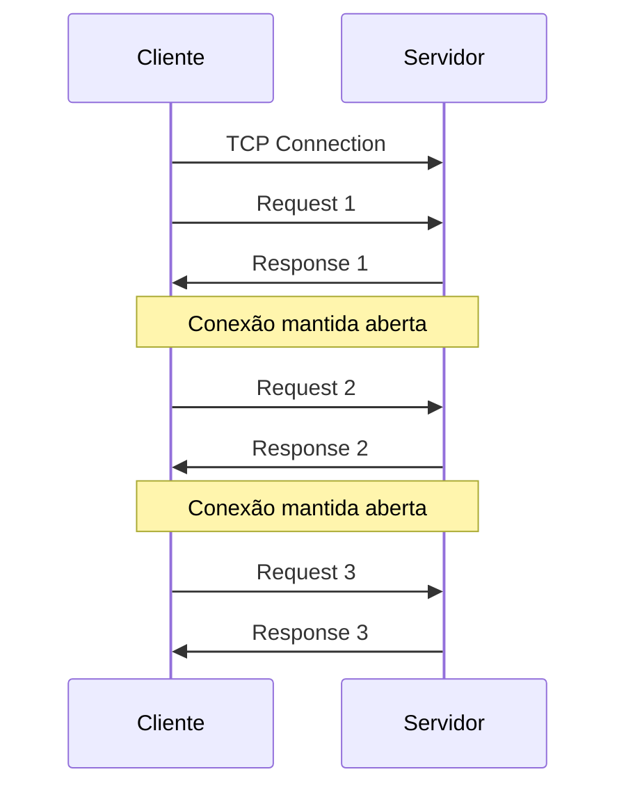

# Ciclo de Vida de uma Requisição HTTP em Go

## Introdução

Entender o ciclo de vida de uma requisição HTTP em Go é fundamental para desenvolver aplicações web eficientes e seguras. Vamos explorar cada etapa do processo, desde a chegada da requisição até o envio da resposta.

## 1. Visão Geral do Ciclo



## 2. Etapas Detalhadas

### 2.1 Conexão TCP

```go
// Internamente, o servidor cria um listener TCP
listener, err := net.Listen("tcp", ":8080")
```

1. Cliente inicia conexão TCP
2. Servidor aceita conexão
3. Nova goroutine é criada para cada conexão

### 2.2 Parsing da Requisição

```go
// net/http/server.go (simplificado)
func (c *conn) readRequest() (*Request, error) {
    // 1. Ler primeira linha
    line, err := c.readLine()
    method, uri, proto, ok := parseRequestLine(line)
    
    // 2. Ler headers
    headers, err := c.readHeaders()
    
    // 3. Criar Request
    req := &Request{
        Method:     method,
        URL:        uri,
        Proto:      proto,
        Header:     headers,
        Body:       body,
        RemoteAddr: c.remoteAddr,
    }
    
    return req, nil
}
```

### 2.3 Roteamento

```go
// Exemplo de roteamento com ServeMux
mux := http.NewServeMux()

mux.HandleFunc("/api/users", func(w http.ResponseWriter, r *http.Request) {
    // Handler será chamado quando a rota corresponder
})
```

1. ServeMux recebe a requisição
2. Encontra o handler mais específico
3. Chama o método ServeHTTP do handler

### 2.4 Execução do Handler

```go
func (h *userHandler) ServeHTTP(w http.ResponseWriter, r *http.Request) {
    // 1. Validar requisição
    if err := validateRequest(r); err != nil {
        http.Error(w, err.Error(), http.StatusBadRequest)
        return
    }
    
    // 2. Processar requisição
    result, err := h.process(r)
    if err != nil {
        http.Error(w, err.Error(), http.StatusInternalServerError)
        return
    }
    
    // 3. Enviar resposta
    json.NewEncoder(w).Encode(result)
}
```

### 2.5 Escrita da Resposta

```go
type responseWriter struct {
    status      int
    written     bool
    headers     http.Header
    body        []byte
    conn        *conn
}

func (w *responseWriter) WriteHeader(status int) {
    if w.written {
        return // Headers já foram enviados
    }
    w.status = status
    w.written = true
    w.writeHeaders()
}

func (w *responseWriter) Write(data []byte) (int, error) {
    if !w.written {
        w.WriteHeader(http.StatusOK) // Status padrão
    }
    return w.conn.write(data)
}
```

## 3. Middlewares no Ciclo

### 3.1 Cadeia de Middlewares


### 3.2 Implementação

```go
func loggingMiddleware(next http.Handler) http.Handler {
    return http.HandlerFunc(func(w http.ResponseWriter, r *http.Request) {
        // 1. Pré-processamento
        start := time.Now()
        
        // 2. Chamar próximo handler
        next.ServeHTTP(w, r)
        
        // 3. Pós-processamento
        log.Printf("%s %s %v", r.Method, r.URL.Path, time.Since(start))
    })
}
```

## 4. Keep-Alive e Conexões Persistentes

### 4.1 Como Funciona



### 4.2 Configuração

```go
server := &http.Server{
    IdleTimeout: 120 * time.Second,  // Tempo máximo de conexão ociosa
    MaxHeaderBytes: 1 << 20,         // Tamanho máximo do header
}
```

## 5. Tratamento de Erros

### 5.1 Erros Comuns

```go
func (h *Handler) ServeHTTP(w http.ResponseWriter, r *http.Request) {
    // 1. Erro de validação
    if err := validate(r); err != nil {
        http.Error(w, err.Error(), http.StatusBadRequest)
        return
    }
    
    // 2. Erro de processamento
    result, err := h.process(r)
    if err != nil {
        switch e := err.(type) {
        case *NotFoundError:
            http.Error(w, e.Error(), http.StatusNotFound)
        case *ValidationError:
            http.Error(w, e.Error(), http.StatusBadRequest)
        default:
            http.Error(w, "Internal Server Error", http.StatusInternalServerError)
        }
        return
    }
    
    // 3. Sucesso
    json.NewEncoder(w).Encode(result)
}
```

### 5.2 Recuperação de Pânico

```go
func recoveryMiddleware(next http.Handler) http.Handler {
    return http.HandlerFunc(func(w http.ResponseWriter, r *http.Request) {
        defer func() {
            if err := recover(); err != nil {
                log.Printf("Panic: %v", err)
                http.Error(w, "Internal Server Error", http.StatusInternalServerError)
            }
        }()
        next.ServeHTTP(w, r)
    })
}
```

## 6. Boas Práticas

1. **Sempre feche o body das requisições**
   ```go
   defer r.Body.Close()
   ```

2. **Use timeouts apropriados**
   ```go
   server := &http.Server{
       ReadTimeout:  15 * time.Second,
       WriteTimeout: 15 * time.Second,
       IdleTimeout:  60 * time.Second,
   }
   ```

3. **Limite o tamanho dos payloads**
   ```go
   r.Body = http.MaxBytesReader(w, r.Body, maxBodySize)
   ```

4. **Implemente graceful shutdown**
   ```go
   server.Shutdown(ctx)
   ```

5. **Use logging apropriado**
   ```go
   log.Printf("%s %s %d %v", r.Method, r.URL.Path, status, duration)
   ```

## Próximos Passos

- [Middlewares](../4-avancado/01-middlewares.md)
- [Segurança e TLS](../4-avancado/02-seguranca.md)
- [Performance e Otimização](../4-avancado/03-performance.md) 