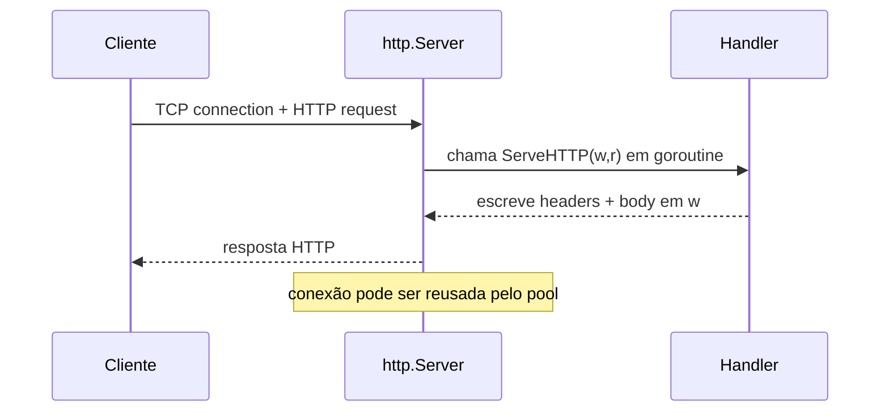

# Trabalhando com a Web

A web, ou World Wide Web (WWW), é um sistema de documentos interligados que são acessados pela internet. Desde sua criação no final dos anos 1980, a web evoluiu de um conjunto simples de páginas estáticas para um ecossistema dinâmico e interativo, suportado por tecnologias como HTTP, HTML, CSS e JavaScript. No centro dessa evolução está o protocolo HTTP, que define como os navegadores e servidores se comunicam.

Para entender melhor como os servidores HTTP evoluíram ao longo do tempo, veja a [história dos servidores HTTP](history.md), onde exploramos desde o HTTP/0.9 até os modelos modernos baseados em threads e event loops.

# Pacote `net/http` em Go — visão geral completa e didática  

> **Resumo em uma frase**  
> O pacote `net/http` oferece tudo o que você precisa para construir **clientes** e **servidores** HTTP eficientes, seguros e de alto desempenho, aproveitando o modelo de concorrência leve do Go.

---

## 1. Por que o pacote `net/http` existe?

Quando o Go foi lançado em 2009, um dos objetivos principais era **simplificar o desenvolvimento de serviços de rede**. Antes disso, era comum depender de bibliotecas externas ou escrever muito código para lidar com servidores e clientes HTTP. Para resolver esse problema, a equipe do Go decidiu incluir um pacote HTTP completo e eficiente diretamente na linguagem.

### O que significa "baterias incluídas"?

O pacote `net/http` foi projetado para ser uma solução completa, cobrindo desde os **níveis mais baixos** (como conexões de rede via _sockets_) até os **níveis mais altos** (como roteamento de requisições). Isso significa que você pode:

- Criar um servidor HTTP básico com poucas linhas de código.
- Fazer requisições HTTP como cliente sem precisar de bibliotecas externas.
- Trabalhar com headers, cookies, TLS, e muito mais.

---

## 2. Conceitos fundamentais  

| Conceito | Descrição rápida |
|----------|-----------------|
| **Handler** | Qualquer valor que implemente `ServeHTTP(w http.ResponseWriter, r *http.Request)`; é aqui que colocamos a lógica de cada rota. |
| **ServeMux** | _Router_ padrão que mapeia _paths_ para `Handler`s. No Go 1.22 recebeu **padrões de rota** com _wildcards_ e _method matching_ (ex.: `"GET /posts/{id}"`) citeturn0search0 |
| **http.Server** | Estrutura que recebe conexões, decodifica requisições, aciona o handler e escreve a resposta. Já vem com _TLS_, _timeouts_, _graceful shutdown_ etc. |
| **http.Client** | Alto‑nível para fazer requisições; reutiliza conexões (HTTP/1.1 keep‑alive ou HTTP/2), segue redirects e permite _middlewares_ via `Transport`. |
| **Request / Response** | Estruturas ricas que encapsulam headers, body (como `io.ReadCloser`), contexto (`r.Context()`), cookies, trailers e muito mais. |

---

## 3. Ciclo de vida de uma requisição  



O servidor dispara **uma goroutine por requisição**, eliminando o velho modelo “thread‑per‑request” com overhead caro de SO.  

---

## 4. Exemplo mínimo de servidor  

```go
package main

import (
	"fmt"
	"net/http"
)

func main() {
	http.HandleFunc("/hello", func(w http.ResponseWriter, r *http.Request) {
		fmt.Fprintf(w, "Olá, %s!", r.URL.Query().Get("name"))
	})
	if err := http.ListenAndServe(":8080", nil); err != nil {
		panic(err)
	}
}
```

- `HandleFunc` registra o handler na **ServeMux** padrão (`nil` no `ListenAndServe`).  
- Cada requisição roda em **goroutine**; a concorrência é transparente.  
- O servidor responde a `GET /hello?name=Cauê` com “Olá, Cauê!”.

---

## 5. Exemplo de rota REST com os **padrões** do Go 1.22  

```go
http.Handle("GET /posts/{id}", func(w http.ResponseWriter, r *http.Request) {
	id := r.PathValue("id") // extrai parâmetro diretamente
	fmt.Fprintf(w, "Post ID = %s\n", id)
})
```

- `PathValue` busca parâmetros convertidos do caminho.  
- Assegura que só métodos `GET` atinjam esse handler.  
- Reduz dependência de _routers_ externos para APIs simples. citeturn0search0

---

## 6. Estrutura de cliente  

```go
client := &http.Client{
	Timeout: 5 * time.Second,
}

resp, err := client.Get("https://api.example.com/v1/status")
if err != nil { /* tratar erro */ }
defer resp.Body.Close()

var status Status
if err := json.NewDecoder(resp.Body).Decode(&status); err != nil { /* ... */ }
```

- O `Client` mantém internamente um **pool de conexões** (`Transport`).  
- Suporta _context.Context_, _cookies_, proxies, HTTP/2 e _compression_.  

---

## 7. Segurança e produção  

* **TLS automático** – basta fornecer `CertFile` e `KeyFile` ou usar `http/httptest` para _mTLS_.  
* **Middlewares** – encadeie handlers com funções que retornam `http.Handler`.  
* **Observabilidade** – exponha métricas via `expvar`, registre logs de acesso no seu middleware ou use `net/http/pprof` para profiling.  
* **Limites** – controle tamanho de payload com `MaxHeaderBytes`, `r.Body` + `io.LimitedReader`, e tempos com `ReadHeaderTimeout`, `IdleTimeout`.  

---

## 8. Novidades recentes (Go 1.22)  

| Recurso | O que faz | Benefício |
|---------|-----------|-----------|
| **Padrões de rota** | `"GET /users/{id}"`, `"POST /files/*"` | Simplifica roteamento sem libs externas |
| **Method matching** | Especifica métodos aceitos na _string_ da rota | Menos _boilerplate_ |
| **Wildcard `*`** | Captura sufixo path como `r.PathValue("*")` | Implementa _catch‑all_ elegantemente |
| **Melhor seleção de rota** | Algoritmo novo para desempate | Certeza de rota mais específica ser escolhida citeturn0search2 |

---

## 9. Quando (não) usar?  

✅ Microserviços, APIs REST, _mock servers_, _reverse proxies_, _webhooks_.  
❌ Aplicações web complexas com _template engine_, sessões, ORM, etc. → pode preferir um framework (Echo, Gin, Fiber) que abstrai muito mais coisa.  

---

## 10. Dicas finais  

1. Comece simples com `http.ListenAndServe`, depois extraia um `http.Server` configurável.  
2. Propague `context.Context` para cancelar requisições em cascata.  
3. Use `httptest.NewServer` para testes de integração rápidos.  
4. Profile seu servidor com `go tool pprof` + `net/http/pprof`.  
5. Adote _timeouts_ e limites de tamanho desde o primeiro commit.

---

## Próximos passos — 10 prompts para aprofundar

1. **“Como usar os novos padrões de rota do Go 1.22 para criar uma API RESTful completa?”**  
2. **“Explique detalhadamente o ciclo de vida de conexões reutilizadas (`Keep‑Alive`) no `http.Client`.”**  
3. **“Quais são as melhores práticas de segurança TLS/HTTPS ao usar `http.Server` em produção?”**  
4. **“Como implementar middlewares de _logging_, _rate‑limiting_ e _CORS_ usando apenas `net/http`?”**  
5. **“Demonstre testes unitários e de integração com `httptest` para handlers HTTP.”**  
6. **“Compare `net/http` puro com frameworks (Gin, Echo) em termos de performance e ergonomia.”**  
7. **“Mostre como expor métricas Prometheus via `expvar` ou handlers customizados em Go.”**  
8. **“Como fazer _graceful shutdown_ de um servidor HTTP lidando com requisições em voo?”**  
9. **“Quais configurações de tempos (`ReadTimeout`, `IdleTimeout`) evitam ataques de lentidão (Slowloris)?”**  
10. **“Integre HTTP/2 e `h2c` (sem TLS) em um servidor Go, explicando requisitos e pitfalls.”**

Explore cada tópico para dominar de vez o pacote `net/http`!